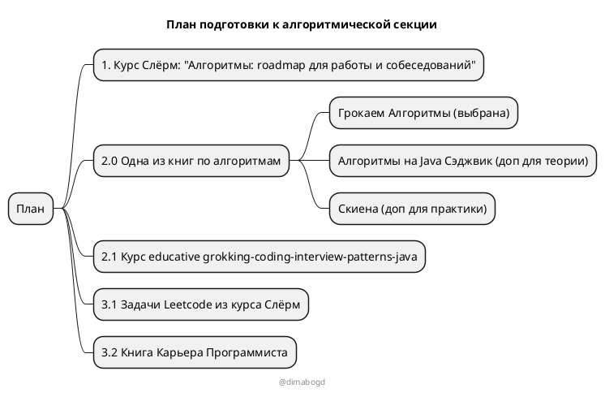

# dsa
Data structure and algorithms

```plantuml
@startmindmap

title План подготовки к алгоритмической секции

* План
** 1. Курс Слёрм: "Алгоритмы: roadmap для работы и собеседований"
** 2.0 Одна из книг по алгоритмам
*** Грокаем Алгоритмы (выбрана)
*** Алгоритмы на Java Сэджвик (доп для теории)
*** Скиена (доп для практики)
** 2.1 Курс educative grokking-coding-interview-patterns-java
** 3.1 Задачи Leetcode из курса Слёрм
** 3.2 Книга Карьера Программиста

center footer @dimabogd

@endmindmap
```
